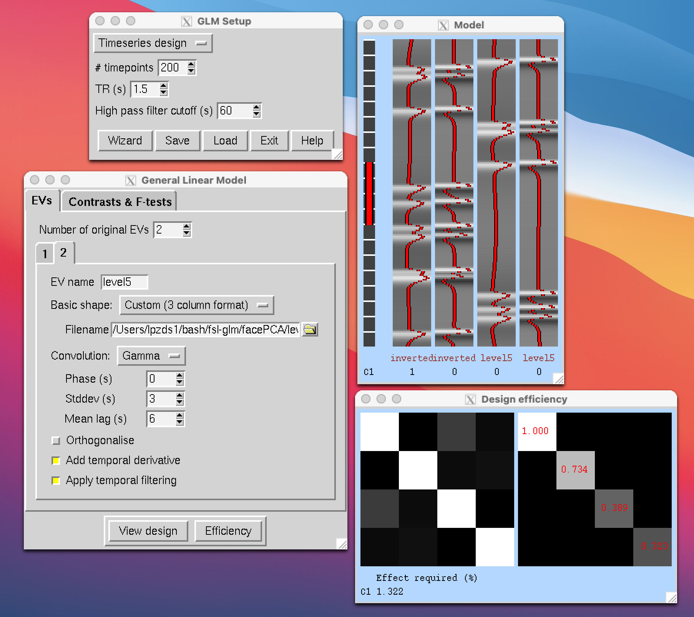
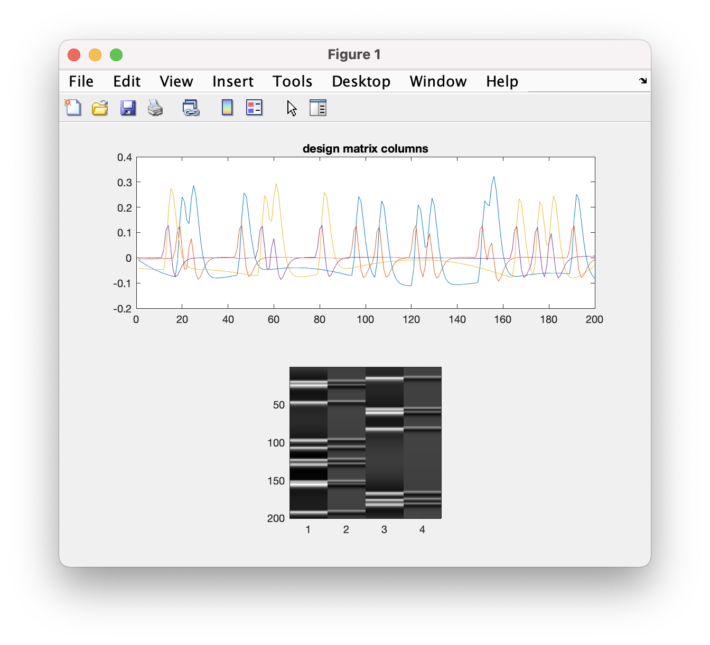
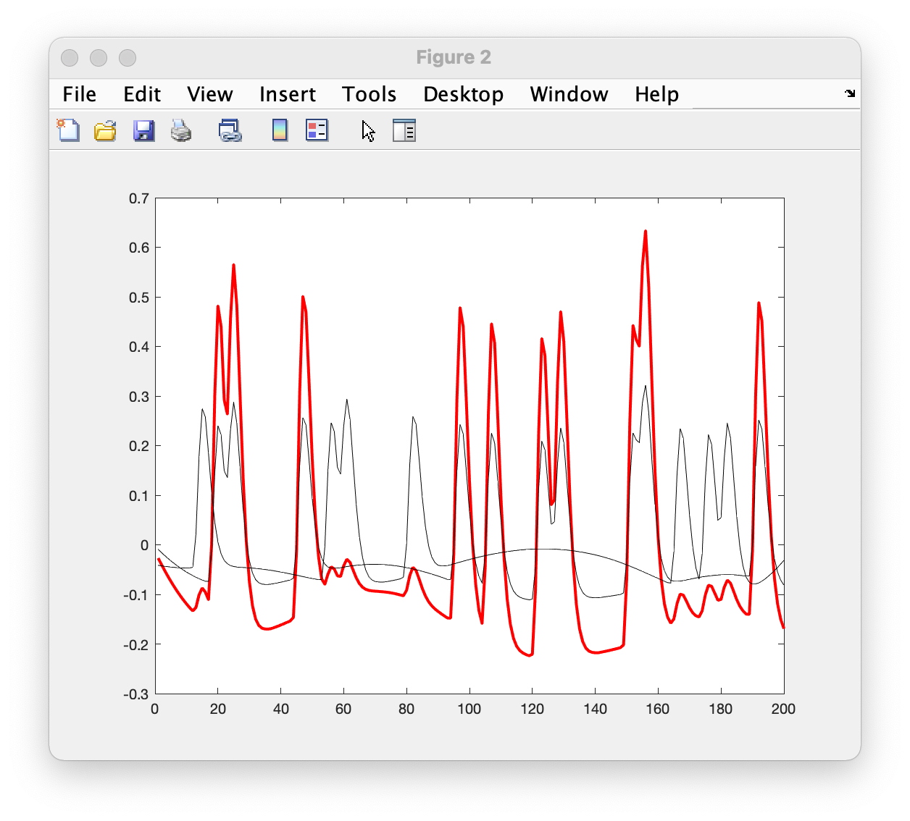

# fsl-glm

some thoughts about setting up GLMs for event-related experiments and also thinking about designs etc.

## facePCA

From the `facePCA` experiment: 
- take the timing file (in `csv` format) and turn it into a 3 column file for use with `fsl`.
- one txt file each for an event class / category
- each row in this file: 1 event
- 3 columns: (1) start time in s, (2) duration in s, (3) scaled level - always = 1.0 (see description in `fsl` documentation for details)

*note* - I did the data munging in `r` as it's a bit easier with text based data, imo. In the example folder, I work through to create two example files `inverted_trials.txt`, the event timings for all those trials - and `level5_trials.txt` for that category

Assuming you have `fsl` installed, setting up the GLM is then:

```bash
Glm_gui & # and follow instructions + bubble help
```



If you fancy making use of the GLM design matrix in `matlab` you can then chop the .mat file in the shell (which is a text / matrix file... not a *MAT* file, confusingly):

shell:
```bash
tail -n +6 example_facePCA.mat > designMatrix.txt
```

matlab:
```matlab
% have a look at test_glm.m
```





